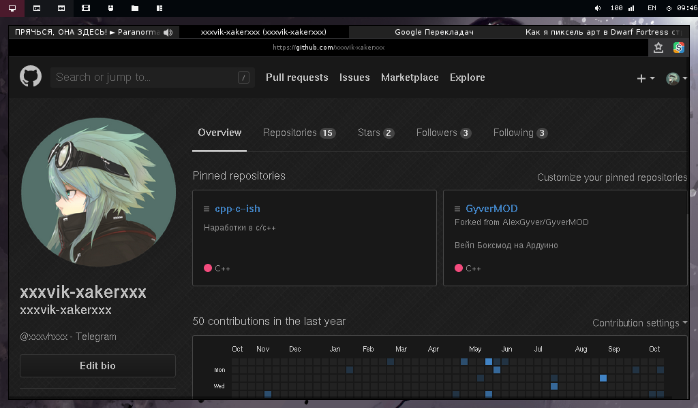

Dotfile DWM
===========

This is my favorite config at the moment:
	* WM: DWM
	* Terminal: Evilvte, ST
	* Menu: Rofi, Dmenu
	* Indicator: Dwm-status (bash script)
	* Browser: Firefox
	* Editor: Vim, SublimeText3, Emacs
---

## Screan

---

---

---

---

---

---
